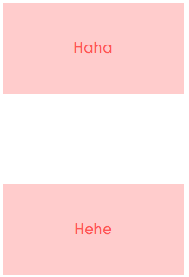
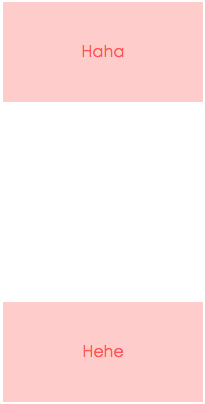
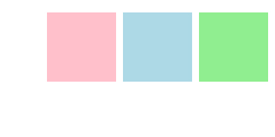
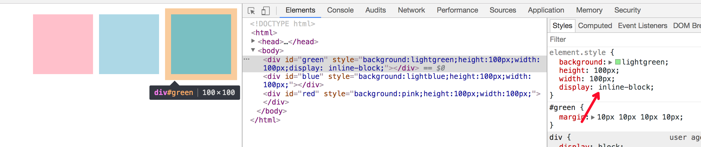

## BFC刨析
### BFC是什么？
```js
Block fomatting context = block-level box + Formatting Context
```
### Box:

#### Box即盒子模型;
* block-level box即块级元素
> display属性为block,list-item,table的元素,，会生成block-level box；并且参与 block fomatting context;
* inline-level box即行内元素
> display属性为inline, inline-block, inline-table的元素，会生成inline-level box。并且参与 inline formatting context;
#### Formatting context
　Formatting context是W3C CSS2.1规范中的一个概念。它是页面中的一块渲染区域，并且有一套渲染规则，它决定了其子元素将如何定位，以及和其他元素的关系、相互作用。最常见的 Formatting context 有 Block fomatting context (简称BFC)和 Inline formatting context(简称IFC)。
CSS2.1 中只有BFC和IFC, CSS3中还增加了G（grid）FC和F(flex)FC。
#### BFC定义
BFC(Block formatting context)直译为"块级格式化上下文"。它是一个独立的渲染区域，只有Block-level box参与， 它规定了内部的Block-level Box如何布局，并且与这个区域外部毫不相干。 　

### BFC约束规则
1，BFC内元素垂直方向的边距会发生重叠（当兄弟元素的外边距不一样时，将以最大的那个外边距为准。）
2，BFC的区域不会与浮动元素的BOX重叠（清除浮动）
3，BFC在页面上是一个容器，外面的元素不会影响到里面的元素
4，计算BFC元素高度时，即使是浮动元素也会参与计算
5，每个元素的左外边距与包含块的左边界相接触（从左向右），即使浮动元素也是如此。（这说明BFC中子元素不会超出他的包含块，而position为absolute的元素可以超出他的包含块边界）

### BFC的生成
上文提到BFC是一块渲染区域，那这块渲染区域到底在哪，它又是有多大，这些由生成BFC的元素决定，CSS2.1中规定满足下列CSS声明之一的元素便会生成BFC

* float的值不为none

* overflow的值不为visible

* display的值为inline-block、table-cell、table-caption
> display：table也认为可以生成BFC，其实这里的主要原因在于Table会默认生成一个匿名的table-cell，正是这个匿名的table-cell生成了BFC

* position的值为abslolute或fixed

###  BFC在布局中的应用
1.防止margin重叠（塌陷）：
BFC内元素垂直方向的边距会发生重叠（当兄弟元素的外边距不一样时，将以最大的那个外边距为准。）
```css
<style>
    p {
        color: #f55;
        background: #fcc;
        width: 200px;
        line-height: 100px;
        text-align:center;
        margin: 100px;
    }
</style>
<body>
    <p>Haha</p>
    <p>Hehe</p>
</body>
```

两个p之间的距离为100px，发送了margin重叠（塌陷），以最大的为准，如果第一个P的margin为80的话，两个P之间的距离还是100，以最大的为准。

根据BFC布局规则第二条：
>Box垂直方向的距离由margin决定。属于同一个BFC(上例中是body根元素的BFC)的两个相邻Box的margin会发生重叠

可以在p外面包裹一层容器，并触发该容器生成一个新BFC。那么两个P便不属于同一个BFC，就不会发生margin重叠了。
```html
<style>
    .wrap {
        overflow: hidden;// 新的BFC
    }
    p {
        color: #f55;
        background: #fcc;
        width: 200px;
        line-height: 100px;
        text-align:center;
        margin: 100px;
    }
</style>
<body>
    <p>Haha</p>
    <div class="wrap">
        <p>Hehe</p>
    </div>
</body>
```



相邻Box水平方向margin重叠

```html
<!doctype HTML>
<html>
<head>
<style type="text/css">

    #green {
        margin:10px 10px 10px 10px
    }
    #blue {
        margin:10px 10px 10px 10px
    }
    #red {
        margin:10px 10px 10px 10px
    }
    body {
        writing-mode:tb-rl;
    }

</style>
</head>
<body>

<div id="green" style="background:lightgreen;height:100px;width:100px;"></div>
<div id="blue" style="background:lightblue;height:100px;width:100px;"></div>
<div id="red" style="background:pink;height:100px;width:100px;"></div>

</body>
</html>
```
看到水平方向的margin发生了重叠。



可以给div加个display:inline-block，触每个div容器生成一个BFC。那么三个DIV便不属于同一个BFC（此时body根元素形成的BFC），就不会发生margin重叠了。



嵌套元素的margin重叠

```html
<style> 
    html, body { height: 100%; width: 100%; margin: 0; padding: 0; }
    #map{
      padding:0;
    }
    .first{
      margin:20px;
      background:lightgreen;
      width:100px;
      height:100px;
    }
    ul{
      /*display:inline-block;*/
      margin:10px;
      background:lightblue;
    }
    li{
      margin:25px;
    }
</style>

<body class="claro"> 
  <div class="first"></div>
  <ul>
    <li>1</li>
    <li>2</li>
    <li>3</li>
  </ul>
</body> 
```