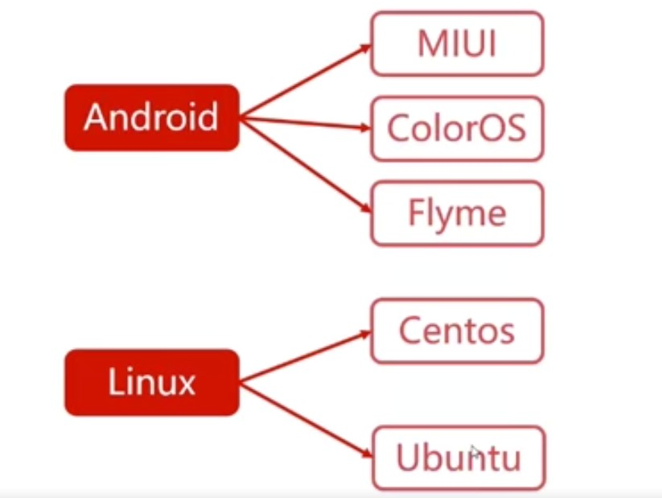
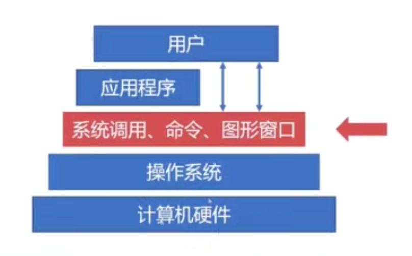
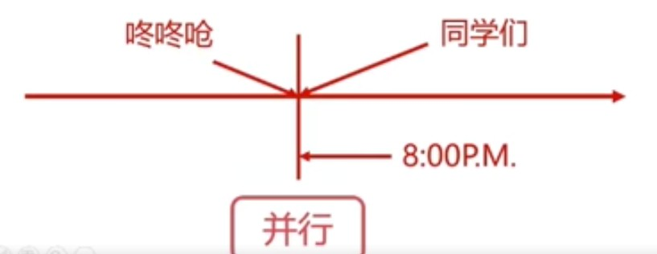
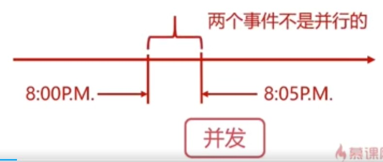
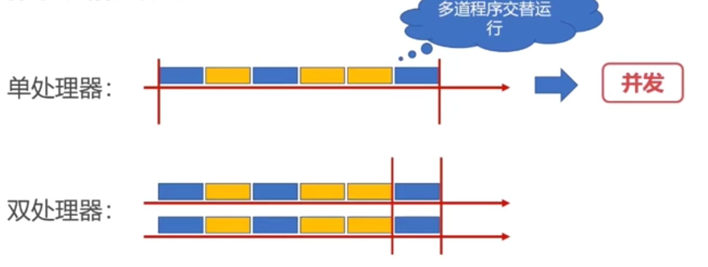
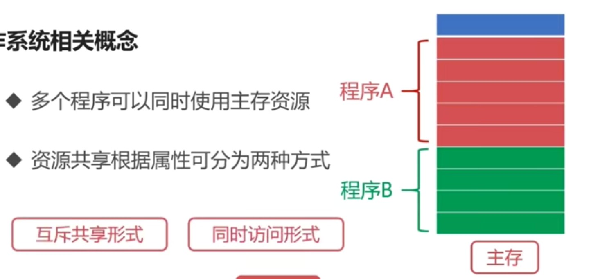

## 操作系统概述
### What & Why

定义：管理硬件、提供用户交互的软件系统

* 操作系统是管理计算机硬件和软件资源的`计算机程序`
* 管理配置内存、决定资源供需顺序、控制输入输出设备
* 操作系统提供让用户和系统交互的`操作界面`
* 不局限于计算机
* 从手机到计算机，操作系统可简单可复杂

我们不可能直接操作计算机硬件

设备种类繁多复杂，需要统一界面
操作系统的简易性使得更多人能使用计算机

#### 操作系统的基本资源
处理器资源、存储器资源、IO设备资源、文件资源

>`操作系统统一管理着计算机资源`,
`用户无需面向硬件接口编程`,
`IO设备管理软件，提供读写接口`,
`文件管理软件，提供操作文件接口`,`操作系统提供了用户和计算机之间的接口`

图像窗口形式、命令形式、系统调用形式

#### 操作系统相关概念

* 并发性
并行VS并发
并行是指两个或多个事件可以在`同一时刻`发生

并发是指两个或多个事件可以在`同一时间间隔`发生

多道程序设计

* 共享性
共享性表现为操作系统中的资源可供多个并发的程序共同使用
这种共同使用的形式为资源共享

互斥共享形式：
当资源被程序A占用时，其他想使用的话只能等待
只有进程A使用完之后，其它进程才可以使用该资源 

同时访问形式：
某种资源在一段时间内并发地被多个程序访问
这种`同时`是宏观的，从宏观去看该资源可以被同时访问

* 虚拟性
表现为把一个`物理实体`转变为`逻辑实体`
物理实体是真实存在的，逻辑实体是虚拟的 
虚拟的技术分为`时分复用技术`和`空分复用技术`

时分复用技术
资源在时间上进行复用，不同程序`并发`使用
多道程序分时使用计算机的硬件资源
提高资源利用律

* 异步性

