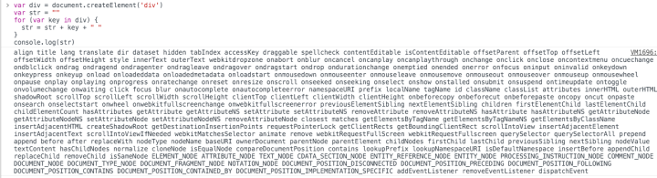
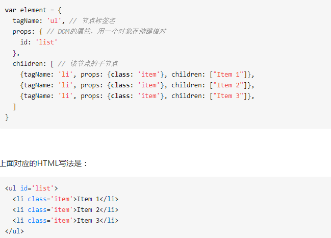

## Virtual Dom 

初步了解：

### 为什么需要 Virtual Dom
操作 DOM 是很耗费性能的一件事情，既然如此，我们可以考虑通过 JS 对象来模拟 DOM 对象，毕竟操作 JS 对象比操作 DOM 省时的多。

一个例子
```js
// 假设这里模拟一个 ul，其中包含了 5 个 li
;[1, 2, 3, 4, 5][
  // 这里替换上面的 li
  (1, 2, 5, 4)
]
```
从上述例子中，我们一眼就可以看出先前的 ul 中的第三个 li 被移除了，四五替换了位置。

如果以上操作对应到 DOM 中，那么就是以下代码

```js
// 删除第三个 li
ul.childNodes[2].remove()
// 将第四个 li 和第五个交换位置
let fromNode = ul.childNodes[4]
let toNode = node.childNodes[3]
let cloneFromNode = fromNode.cloneNode(true)
let cloenToNode = toNode.cloneNode(true)
ul.replaceChild(cloneFromNode, toNode)
ul.replaceChild(cloenToNode, fromNode)
```

当然在实际操作中，我们还需要给每个节点一个标识，作为判断是同一个节点的依据。所以这也是 Vue 和 React 中官方推荐列表里的节点使用唯一的 key 来保证性能。

那么既然 DOM 对象可以通过 JS 对象来模拟，反之也可以通过 JS 对象来渲染出对应的 DOM

以下是一个 JS 对象模拟 DOM 对象的简单实现
```js
export default class Element {
  /**
   * @param {String} tag 'div'
   * @param {Object} props { class: 'item' }
   * @param {Array} children [ Element1, 'text']
   * @param {String} key option
   */
  constructor(tag, props, children, key) {
    this.tag = tag
    this.props = props
    if (Array.isArray(children)) {
      this.children = children
    } else if (isString(children)) {
      this.key = children
      this.children = null
    }
    if (key) this.key = key
  }
  // 渲染
  render() {
    let root = this._createElement(
      this.tag,
      this.props,
      this.children,
      this.key
    )
    document.body.appendChild(root)
    return root
  }
  create() {
    return this._createElement(this.tag, this.props, this.children, this.key)
  }
  // 创建节点
  _createElement(tag, props, child, key) {
    // 通过 tag 创建节点
    let el = document.createElement(tag)
    // 设置节点属性
    for (const key in props) {
      if (props.hasOwnProperty(key)) {
        const value = props[key]
        el.setAttribute(key, value)
      }
    }
    if (key) {
      el.setAttribute('key', key)
    }
    // 递归添加子节点
    if (child) {
      child.forEach(element => {
        let child
        if (element instanceof Element) {
          child = this._createElement(
            element.tag,
            element.props,
            element.children,
            element.key
          )
        } else {
          child = document.createTextNode(element)
        }
        el.appendChild(child)
      })
    }
    return el
  }
}
```

### 真实DOM很慢

* 如果把简单的div元素属性全部打印之后，会得到


* 而这仅仅是第一层。真正的 DOM 元素非常庞大，这是因为标准就是这么设计的。而且操作它们的时候你要小心翼翼，轻微的触碰可能就会导致页面重排，这可是杀死性能的罪魁祸首。

(2)相对于 DOM 对象，原生的 JavaScript 对象处理起来更快，而且更简单。DOM 树上的结构、属性信息我们都可以很容易地用 JavaScript 对象表示出来：


###  Virtual DOM 算法几个步骤

（1）用 JavaScript 对象结构表示 DOM 树的结构；然后用这个对象树构建一个真正的 DOM 树，插到文档当中
（2）当状态变更的时候，重新构造一棵新的对象树。然后用新的对象树和旧的对象树进行比较，记录两棵对象树差异
（3）把2所记录的差异应用到步骤1所构建的真正的DOM树上，视图就更新了

总体理解：Virtual DOM 本质上就是在 JS 和 DOM 之间做了一个缓存。可以类比 CPU 和硬盘，既然硬盘这么慢，我们就在它们之间加个缓存：既然 DOM 这么慢，我们就在它们 JS 和 DOM 之间加个缓存。CPU（JS）只操作内存（Virtual DOM），最后的时候再把变更写入硬盘（DOM）。